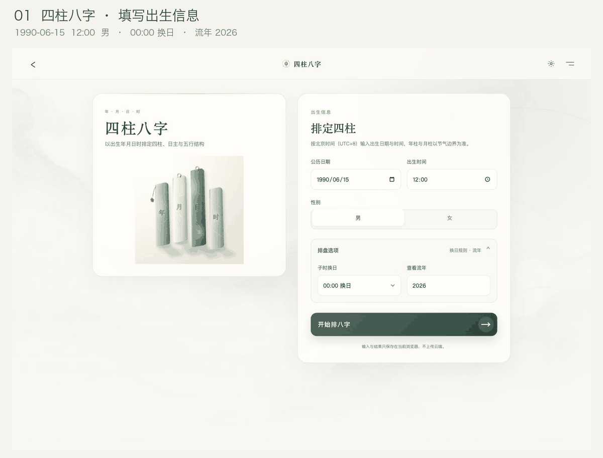
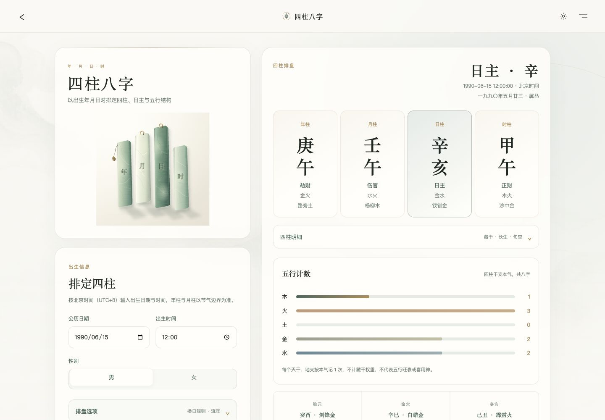
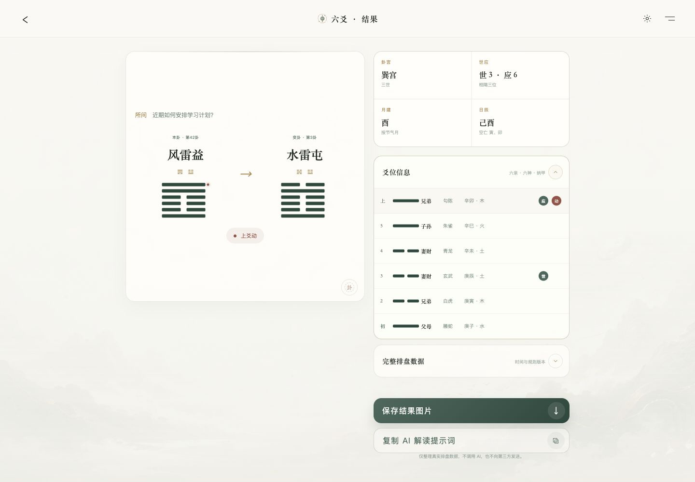
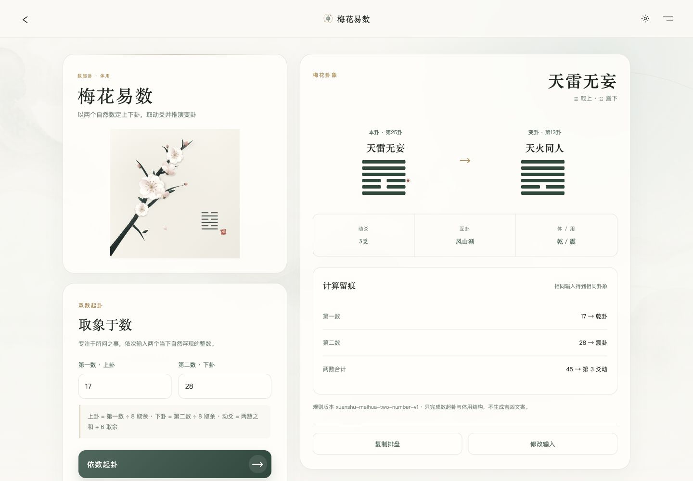
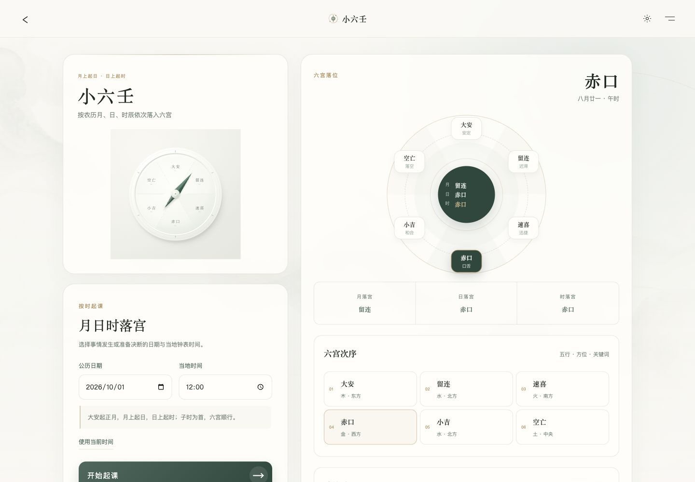
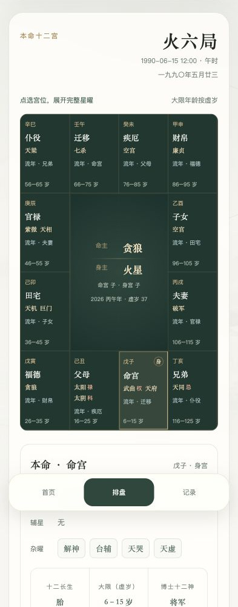
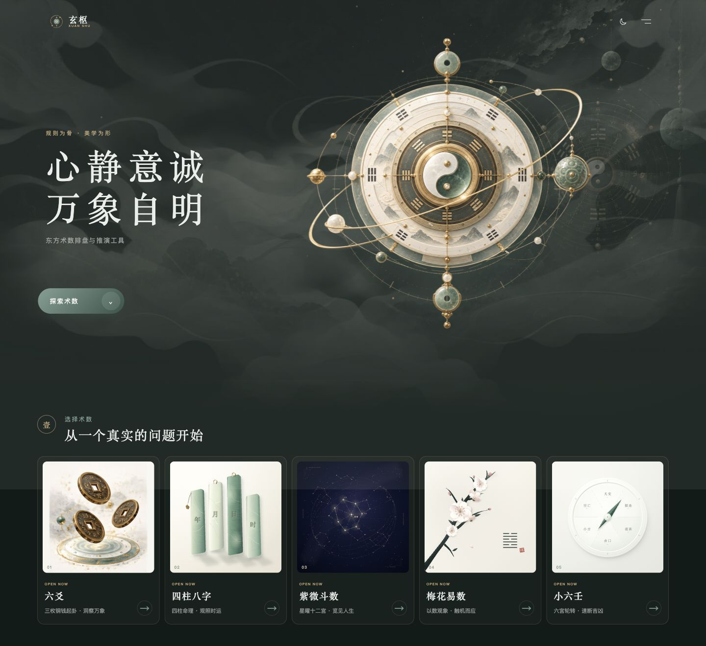
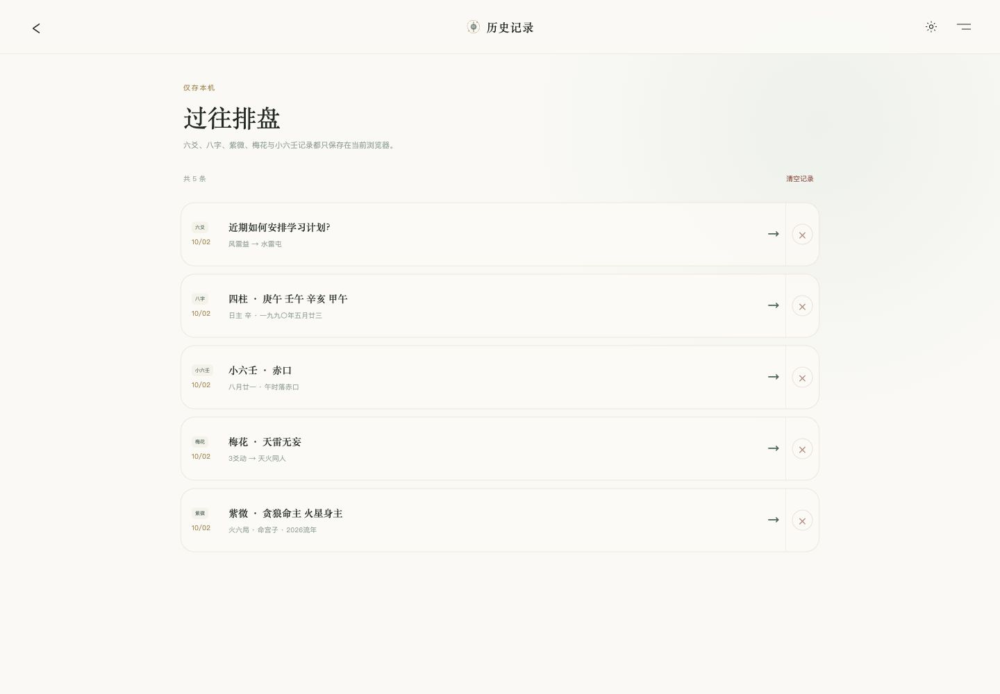

<p align="center">
  
</p>

<p align="center">
  <strong>五门术数，一处排盘。</strong><br />
  在浏览器中起卦、排盘、查看细节，留下属于自己的记录。
</p>

<p align="center">
  <a href="LICENSE"></a>
  <a href="package.json"></a>
  <a href="tsconfig.json"></a>
  <a href="package.json"></a>
</p>

<p align="center">
  <a href="https://47.117.103.246:8443/">在线体验</a> ·
  <a href="#features">功能一览</a> ·
  <a href="#demo">功能演示</a> ·
  <a href="docs/usage.md">使用指南</a> ·
  <a href="#quick-start">快速开始</a> ·
  <a href="docs/deployment.md">自行部署</a> ·
  <a href="docs/calculation-rules.md">计算口径</a>
</p>

---

玄枢是一个开源的东方术数排盘工具，支持 **六爻、四柱八字、紫微斗数、梅花易数、小六壬**。它把输入、规则计算与结果展示放在同一个工作台中，供传统文化学习、排盘核对与个人参考使用。

**无需注册，无需 API Key。** 当前版本使用规则引擎完成排盘，不接入 AI 解读服务。

<p align="center">
  
</p>

### 使用体验

| 一处完成 | 细节可查 | 记录属于自己 |
| :--- | :--- | :--- |
| 五门术数统一入口；桌面与手机均可操作；支持浅色、深色主题。 | 展示四柱、宫位、爻位与计算过程；换日、闰月等规则明确标注。 | 排盘在浏览器内计算，历史存于本机；可重新打开、复制或删除。 |

<a id="features"></a>

## 功能一览

| 术数 | 起盘方式 | 主要结果 | 交互与保存 |
| :--- | :--- | :--- | :--- |
| **六爻** | 所问之事；三钱法六次投掷 | 本卦、变卦、动爻、八宫、世应、纳甲、六亲、六神、月建、日辰、旬空 | 逐次投掷动画；查看爻位明细；导出 PNG 结果摘要；复制解读提示词 |
| **四柱八字** | 公历出生日期、时间、性别；换日规则与流年年份 | 节气四柱、日主、十神、藏干、十二长生、旬空、纳音、五行计数、胎元、命身宫、起运、大运、流年 | 展开四柱明细；切换 00:00 / 23:00 换日；复制排盘文字 |
| **紫微斗数** | 公历出生日期、时间、性别；可选流年年份 | 十二宫、主星、辅星、杂曜、亮度、生年四化、命身主、五行局；流年宫位、四化、星曜与大限 | 点选宫位查看星曜；本命与流年叠盘；复制排盘文字 |
| **梅花易数** | 两个 1—999999 的整数 | 本卦、互卦、变卦、动爻、体用；数字到卦象的计算过程 | 核对取余步骤；修改数字重算；复制排盘文字 |
| **小六壬** | 公历日期与钟表时间 | 农历月日、时辰、月宫、日宫、最终落宫；逐步顺推过程 | 使用当前时间；查看六宫次序与闰月取法；复制起课文字 |

完成排盘后自动保存本机记录。五门术数可在历史页统一查看和删除；八字、紫微、梅花、小六壬恢复输入后按相应规则复算，六爻恢复已经保存的起卦结果。

<a id="demo"></a>

## 功能演示

以下为实际页面操作截图，演示输入均为公开测试样例，不含个人出生信息。

<p align="center">
  
</p>

### 四柱八字与紫微斗数

两张截图使用相同样例：**1990-06-15 · 12:00 · 男 · 流年 2026**。八字选择 **00:00 换日**；紫微填写流年年份后叠加年度宫位。

<table>
  <tr>
    <td width="50%" align="center"><strong>四柱八字</strong><br /><br /><a href="docs/images/bazi-full.jpg"></a></td>
    <td width="50%" align="center"><strong>紫微斗数</strong><br /><br /><a href="docs/images/ziwei-full.jpg"></a></td>
  </tr>
  <tr>
    <td>点击「开始排八字」 → 查看 <strong>庚午 · 壬午 · 辛亥 · 甲午</strong>；展开四柱明细，核对藏干、长生与旬空。</td>
    <td>生成命盘 → 点击宫位查看主星、辅星和杂曜；样例为 <strong>火六局，命主贪狼、身主火星</strong>，叠加 2026 丙午流年。</td>
  </tr>
</table>

<details>
<summary><strong>六爻：从投掷到完整排盘</strong></summary>

输入「近期如何安排学习计划？」→ 开始起卦 → 依次完成六次投掷 → 查看本卦、变卦和爻位明细。每次起卦的爻值来自随机投掷，问题文字相同并不意味着卦象相同；动画展示的是已经锁定的结果。



结果页可导出 **1440 × 1920 PNG 结果摘要**，其中问题文本取前 28 个字符；也可复制包含完整问题和真实排盘数据的解读提示词。复制操作本身不调用 AI 服务。

</details>

<details>
<summary><strong>梅花易数与小六壬：看见计算过程</strong></summary>

<table>
  <tr>
    <td width="50%" align="center"><strong>梅花易数</strong><br /><br /><a href="docs/images/meihua-full.jpg"></a></td>
    <td width="50%" align="center"><strong>小六壬</strong><br /><br /><a href="docs/images/xiaoliuren-full.jpg"></a></td>
  </tr>
  <tr>
    <td>输入 <strong>17 / 28</strong> → 点击「依数起卦」 → <strong>天雷无妄，三爻动，变天火同人</strong>；互卦风山渐，体乾、用震。</td>
    <td>输入 <strong>2026-10-01 / 12:00</strong> → 点击「开始起课」 → 农历八月廿一、午时；<strong>月落留连 → 日落赤口 → 时落赤口</strong>。</td>
  </tr>
</table>

两门都保留中间步骤，可对照取余或顺推过程复算；修改输入后需重新提交，避免把旧结果误当成新输入的结果。

</details>

### 手机界面

<table>
  <tr>
    <td width="50%" align="center"><strong>首页与术数入口</strong><br /><br /><a href="docs/images/home-mobile.jpg"></a></td>
    <td width="50%" align="center"><strong>紫微排盘与宫位查看</strong><br /><br /><a href="docs/images/ziwei-mobile.jpg"></a></td>
  </tr>
</table>

首页点击对应术数进入工作台；紫微使用上方同一测试样例，在手机上点选宫位查看详情。截图可点击打开原图。

<details>
<summary><strong>深色主题与本机历史</strong></summary>

<table>
  <tr>
    <td width="50%" align="center"><strong>深色主题</strong><br /><br /><a href="docs/images/home-dark.jpg"></a></td>
    <td width="50%" align="center"><strong>历史记录</strong><br /><br /><a href="docs/images/history-desktop.jpg"></a></td>
  </tr>
  <tr>
    <td>点击主题切换按钮，查看深色首页；界面也支持系统的减少动态效果偏好。</td>
    <td>完成排盘 → 打开「记录」 → 点击一条记录恢复结果；可删除单条，也可确认后清空本机记录。</td>
  </tr>
</table>

</details>

<a id="quick-start"></a>

## 快速开始

准备 **Node.js ≥ 22.13.0** 和 npm：

```bash
git clone https://github.com/pilipala5/xuanshu.git
cd xuanshu
npm ci
npm run dev -- --hostname 127.0.0.1 --port 5173
```

浏览器打开 **[http://127.0.0.1:5173](http://127.0.0.1:5173)**。无需配置密钥或数据库。

<details>
<summary>开发检查与项目结构</summary>

```bash
npm test
npx tsc --noEmit
npm run lint
npm run build
```

测试覆盖术数规则、节气与晚子时边界、闰月、输入校验及历史恢复。规则引擎与 React、DOM、动画代码分离；六爻随机源可注入 seed 或 mock，方便复算和测试。

```text
app/                         页面与路由
components/                  布局、排盘展示与动画
config/methods.ts            五门术数入口
features/*/engine/           规则引擎
features/liuyao/domain/      六爻领域模型
features/liuyao/storage/     六爻本机记录
features/liuyao/prompts/     提示词与结果图片
features/method-history.ts  其他四门本机记录
public/assets/              品牌、插画与纹理
scripts/package-server.mjs  Node 独立服务打包
tests/                       规则与边界测试
docs/                        部署、计算口径与演示图片
```

技术栈：React 19、TypeScript、Vinext / Vite、Tailwind CSS、Motion、GSAP。历法与安星依赖 [`lunar-typescript`](https://github.com/6tail/lunar-typescript) 和 [`iztro`](https://github.com/SylarLong/iztro)。

</details>

## 自行部署

构建并启动 Node.js 独立服务：

```bash
npm ci
npm run build:server
HOST=127.0.0.1 PORT=3011 node dist/standalone/server.js
```

打开 [http://127.0.0.1:3011](http://127.0.0.1:3011)。`dist/standalone` 包含服务入口、页面构建、静态文件和运行时依赖，可整体复制到服务器。

部署自己的公开站点时，在构建前设置地址：

```bash
XUANSHU_SITE_URL=https://example.com npm run build:server
```

生产部署的 Nginx、HTTPS、systemd、版本切换与回退方法见 **[部署指南](docs/deployment.md)**。

## 计算口径与支持范围

不同流派存在取法差异。玄枢将当前使用的约定写在页面与文档中，便于核对：

- **日期输入**：八字、紫微、小六壬支持 1900—2100 年；梅花支持两个 1—999999 的整数。
- **时间与历法**：八字使用固定北京时间 UTC+8，年、月依节气换界；紫微、小六壬使用输入的钟表日期与时间，不进行出生地或真太阳时校正。
- **细节口径**：八字支持两种日柱换日；紫微明确晚子时、闰月与流年参考日；梅花、小六壬展示计算步骤。
- **当前边界**：未实现旺衰喜用神判断、自动吉凶解读或 AI 服务。八字五行图仅统计四柱表层干支，不表示旺衰。

完整约定、规则版本与可复现样例见 **[计算口径](docs/calculation-rules.md)**。排盘结果是规则计算输出，不构成对预测有效性的承诺。

## 数据与隐私

排盘在浏览器中执行。应用不上传所问之事、出生信息或排盘记录，没有用户账户，也没有服务端历史数据库。

| 项目 | 当前行为 |
| :--- | :--- |
| 六爻记录 | IndexedDB 保存，localStorage 作后备；最多保留 50 条 |
| 其他四门记录 | 共用 localStorage 历史，合计最多保留 50 条 |
| 记录恢复 | 仅当前浏览器、当前站点地址可读取；不跨设备同步 |
| 删除与清理 | 可在历史页删除；清除站点数据后无法自动找回 |
| 复制与导出 | 用户主动复制文字或保存图片；六爻提示词不会自动发送给 AI |

更换浏览器、域名或协议后，原站点记录不会自动迁移。分享截图、结果图或提示词前，请自行检查其中的输入信息。

## 文档与贡献

| 文档 | 内容 |
| :--- | :--- |
| [使用指南](docs/usage.md) | 五门操作步骤、可复现输入、复制与导出、历史与主题 |
| [部署指南](docs/deployment.md) | 独立服务打包、systemd、Nginx、HTTPS 与回退 |
| [计算口径](docs/calculation-rules.md) | 五门规则、时间边界、闰月、流年与复现样例 |
| [贡献指南](CONTRIBUTING.md) | 开发检查、规则变更、问题反馈与截图规范 |
| [第三方许可说明](THIRD_PARTY_NOTICES.md) | 依赖许可及 GSAP 的独立许可条款 |

欢迎通过 [Issue](https://github.com/pilipala5/xuanshu/issues) 报告问题，或提交 Pull Request。排盘差异请附 **脱敏输入、所选规则、实际结果、预期结果与参考依据**。界面问题请附页面地址、设备 / 浏览器、复现步骤与截图。

新增或调整计算规则时，请补充可复现样例与对应测试；提交前运行快速开始中的开发检查。完整规范见 [贡献指南](CONTRIBUTING.md)。

## 许可

项目代码采用 **[MIT License](LICENSE)**。第三方依赖按各自许可证使用，详见 [THIRD_PARTY_NOTICES.md](THIRD_PARTY_NOTICES.md)；GSAP 使用其独立 Standard no-charge license。

术数结果用于传统文化学习与个人参考，不代替医疗、法律或投资等专业判断。
