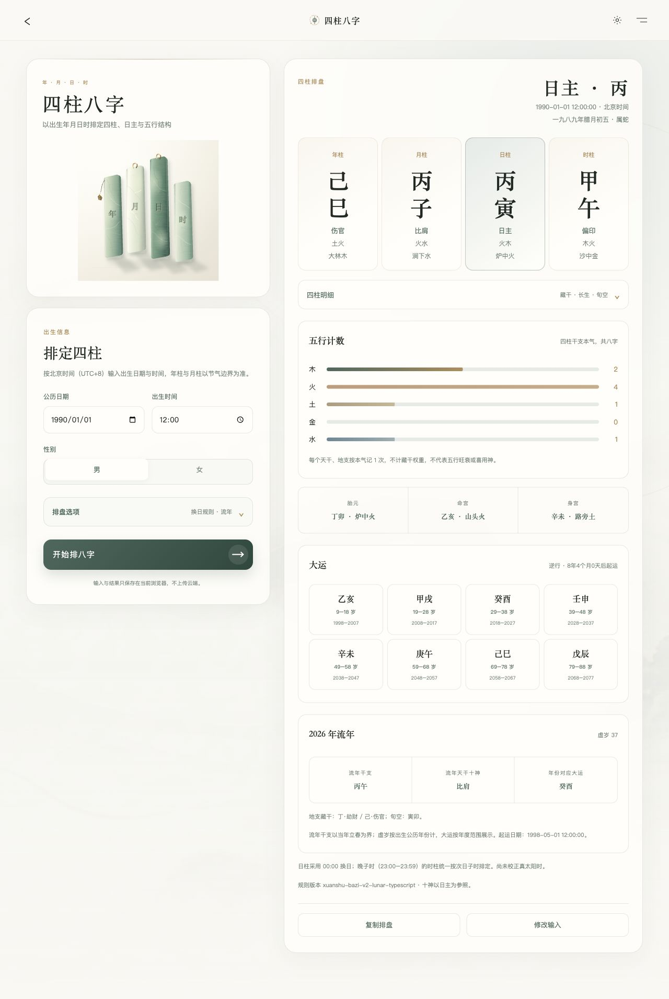

# 玄枢 · XUANSHU

> 心静意诚，万象自明。

玄枢是一个开源的东方术数排盘工具，支持六爻、四柱八字、紫微斗数、梅花易数与小六壬。以确定性规则引擎完成计算，用适配手机和桌面的界面展示结果，历史记录保存在使用者自己的浏览器中。

**无需注册、无需 API Key，打开即可使用。** 项目不接入 AI 解读服务。

[在线体验](https://47.117.103.246:8443/) · [部署说明](docs/deployment.md) · [MIT License](LICENSE)


## 五门术数

| 方法 | 输入与已实现能力 |
| --- | --- |
| **六爻** | 三钱法六次起卦；本卦、变卦、动爻、八宫、世应、纳甲、六亲、六神、节气月建、日辰与旬空；结果长图导出 |
| **四柱八字** | 出生日期、时间与性别；节气四柱、日主、十神、藏干、十二长生、旬空、纳音、五行统计、胎元、命身宫、起运、大运与所选流年；支持 00:00 / 23:00 换日 |
| **紫微斗数** | 出生日期、时间与性别；十二宫、主星、辅星、杂曜、亮度、生年四化、命身主与五行局；可点选宫位，叠加所选流年的宫位、四化、星曜和大限 |
| **梅花易数** | 两个整数起卦；本卦、互卦、变卦、动爻与体用 |
| **小六壬** | 公历日期与时间转换农历月、日、时；六宫落点与逐步计算过程，明确显示闰月取法 |

界面提供浅色 / 深色主题、响应式布局与减少动态效果的系统偏好支持。六爻的铜钱动画读取预先锁定的结果；其余四门可复制排盘文字、修改输入并重算。五门记录统一在历史页查看、恢复和删除。

四门术数配有不同构图的矢量插画，缩放时保持清晰。



## 本地运行

需要 **Node.js ≥ 22.13.0** 和 npm。在项目目录执行：

```bash
git clone https://github.com/pilipala5/xuanshu.git
cd xuanshu
npm ci
npm run dev -- --host 127.0.0.1 --port 5173
```

浏览器打开 [http://127.0.0.1:5173](http://127.0.0.1:5173)。本地使用不需要配置密钥或数据库。

验证代码：

```bash
npm test
npx tsc --noEmit
npm run lint
npm run build
```

测试覆盖术数规则、节气和晚子时边界、闰月、输入校验及历史记录恢复。

## 自托管

构建 Node.js 独立服务：

```bash
npm ci
npm run build:server
HOST=127.0.0.1 PORT=3011 node dist/standalone/server.js
```

`dist/standalone` 包含服务入口、静态文件与运行时依赖，可整体复制到服务器。通过 `XUANSHU_SITE_URL` 设置自己的完整公开地址，再构建；生产环境可使用 Nginx 反向代理和 systemd 管理服务。详见[部署说明](docs/deployment.md)。

## 计算口径

不同流派存在取法差异，以下是当前代码使用的约定：

- **八字**：出生时间按固定北京时间 UTC+8 解释，年柱和月柱依节气换界；日柱默认 00:00 换日，也可选 23:00。晚子时时柱沿用 `lunar-typescript` 的次日子时规则。五行图仅统计四柱八个表层干支的五行，不表示旺衰或喜用神。
- **紫微**：使用 `iztro` 安星规则；闰月初一至十五按当月，十六日起按下月。新盘 23:00 晚子时先推进完整公历日期，再按次日早子时安星；旧版晚子记录保留原取法并标注。流年以农历正月初一换年，年度视图以所选公历年的 7 月 1 日为参考日，虚岁和大限对应此日。
- **六爻**：月建由 `lunar-typescript` 精确节气计算，历法时刻使用固定 UTC+8；日辰使用起卦会话的时区，与页面显示的当地日期一致。
- **梅花**：上下卦分别由两个数除以 8 取余，余 0 作 8；两数之和除以 6 取动爻，余 0 作 6。互卦取二三四爻为下卦、三四五爻为上卦，动爻所在卦为用卦。
- **小六壬**：从大安起正月、从月宫起初一、从日宫起子时逐步顺推；闰月按同名月份处理，不另增一个月。

出生日期输入支持 1900—2100 年。当前未实现出生地 / 真太阳时校正、旺衰喜用神判断或自动解读。排盘程序给出规则计算结果，不对术数预测的有效性作承诺。

## 数据与隐私

排盘在浏览器中执行，应用不上传问题、出生信息或排盘记录，也没有用户账户和服务端历史数据库。六爻使用 IndexedDB，并以 localStorage 作后备；其余四门使用 localStorage。两类历史分别最多保留 50 条。

记录只属于当前浏览器和当前站点地址，不跨设备同步。清除站点数据、使用不同浏览器或更换站点地址后，不会自动恢复原记录。六爻可复制供外部 AI 使用的提示词，复制操作本身不会调用或发送给 AI 服务。

## 技术与结构

React 19、TypeScript、Vinext / Vite、Tailwind CSS、Motion、GSAP；历法与排盘依赖 [`lunar-typescript`](https://github.com/6tail/lunar-typescript) 和 [`iztro`](https://github.com/SylarLong/iztro)。

```text
app/                         页面与路由
components/                  布局、排盘展示与动画组件
config/methods.ts            五门术数的入口配置
features/*/engine/           各术数规则引擎
features/liuyao/domain/      六爻领域模型
features/liuyao/storage/     六爻本地历史
features/liuyao/prompts/     复制提示词与结果长图
features/method-history.ts  其他术数本地历史
public/assets/              界面插画与纹理
scripts/package-server.mjs  独立服务打包
tests/                       规则与数据边界测试
```

规则引擎与 React、DOM、动画代码分离。六爻随机源可以注入 seed 或 mock，方便复算和测试；动画仅展示已锁定的起卦结果。

## 参与与许可

欢迎提交 Issue 和 Pull Request。报告排盘差异时，请附上脱敏后的输入、换日 / 闰月等取法、预期结果与参考依据，便于复现和讨论。新增规则请提供可复现的例子和相应测试。

项目采用 [MIT License](LICENSE)。第三方依赖按各自许可证使用，详见 [THIRD_PARTY_NOTICES](THIRD_PARTY_NOTICES.md)。术数结果用于传统文化学习与个人参考，不代替医疗、法律或投资等专业判断。
